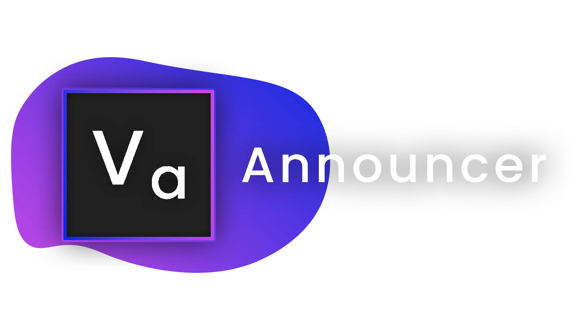

<!--
*** Thanks for checking out the Best-README-Template. If you have a suggestion
*** that would make this better, please fork the repo and create a pull request
*** or simply open an issue with the tag "enhancement".
*** Don't forget to give the project a star!
*** Thanks again! Now go create something AMAZING! :D
-->

<!-- PROJECT SHIELDS -->
<!--
*** I'm using markdown "reference style" links for readability.
*** Reference links are enclosed in brackets [ ] instead of parentheses ( ).
*** See the bottom of this document for the declaration of the reference variables
*** for contributors-url, forks-url, etc. This is an optional, concise syntax you may use.
*** https://www.markdownguide.org/basic-syntax/#reference-style-links
-->
[![Contributors][contributors-shield]][contributors-url]
[![Forks][forks-shield]][forks-url]
[![Stargazers][stars-shield]][stars-url]
[![Issues][issues-shield]][issues-url]
[![MIT License][license-shield]][license-url]
[![LinkedIn][linkedin-shield]][linkedin-url]

<!-- PROJECT LOGO -->
 

  

<h3 align="center">Announcer [Velocity]</h3>

  

    Make network-wide announcements on your Velocity server.
     
    <a href="https://github.com/Matt-MX/AnnouncerVelocity/releases"><strong>Download »</strong></a>
     
     
    <a href="https://github.com/Matt-MX/AnnouncerVelocity/issues">Report Bug</a>
    ·
    <a href="https://github.com/Matt-MX/AnnouncerVelocity/issues">Request Feature</a>
  

<!-- ABOUT THE PROJECT -->
## Features

[comment]: <> ([![Product Name Screen Shot][product-screenshot]]&#40;https://example.com&#41;)

This announcer plugin comes with an easy-to-use GUI! Everything is clearly labelled,
and we provide excellent customization for your announcements.

(<a href="#top">back to top</a>)

### Setup

Firstly, head over to [the release page](https://github.com/Matt-MX/AnnouncerVelocity/releases) and
download the latest version of the plugin. Drag the downloaded jar file into your
plugins folder in your Velocity server.

We also require you to install [Protocolize](https://github.com/Exceptionflug/protocolize) - it's how we are able to provide GUI support!
* [Protocolize](https://github.com/Exceptionflug/protocolize)

(<a href="#top">back to top</a>)

<!-- GETTING STARTED -->
## Getting Started

It's pretty simple, once you've installed this and Protocolize, you can start your
Velocity server and log on.

Give yourself permission to the `/vannouncer` command.
We recommend using [LuckPerms](https://luckperms.net/download) Velocity.

For LuckPerms, run the following command through your Velocity Server's console to allow
yourself to be able to modify permissions from in game: `lpv user {username} permissions set luckperms.* true`

Next you can use the following permission nodes to create and alter announcements:
* `vannouncer.commands.use`
* `vannouncer.commands.reload` *(if you plan on changing the config.yml)*

Now you can run `/vannouncer` in game! If you have followed all steps correctly, you should
see a GUI pop up.

(<a href="#top">back to top</a>)

<!-- USAGE EXAMPLES -->
## Usage

### Create a new Announcement
> Open the GUI through `/vannouncer`, and click the Emerald icon.
> 
> You can then use the other icons to modify the Announcement event.
> 
> We recommend changing the `announcement id` to something you can easily identify,
> e.g: `shop_info`. You can do this by clicking the Paper icon and entering a value.

(<a href="#top">back to top</a>)

<!-- LICENSE -->
## License

Distributed under the MIT License. See `LICENSE.txt` for more information.

(<a href="#top">back to top</a>)

<!-- CONTACT -->
## Contact

MattMX - [MattMX#0033](https://discord.gg)

Project Link: [https://github.com/Matt-MX/AnnouncerVelocity](https://github.com/Matt-MX/AnnouncerVelocity)

(<a href="#top">back to top</a>)

<!-- ACKNOWLEDGMENTS -->
## Acknowledgments

* [Protocolize](https://github.com/Matt-MX/AnnouncerVelocity)
* [Velocity](https://velocitypowered.com/)

(<a href="#top">back to top</a>)

<!-- MARKDOWN LINKS & IMAGES -->
<!-- https://www.markdownguide.org/basic-syntax/#reference-style-links -->

[comment]: <> ([contributors-shield]: https://img.shields.io/github/contributors/othneildrew/Best-README-Template.svg?style=for-the-badge)

[comment]: <> ([contributors-url]: https://github.com/othneildrew/Best-README-Template/graphs/contributors)

[comment]: <> ([forks-shield]: https://img.shields.io/github/forks/othneildrew/Best-README-Template.svg?style=for-the-badge)

[comment]: <> ([forks-url]: https://github.com/othneildrew/Best-README-Template/network/members)

[comment]: <> ([stars-shield]: https://img.shields.io/github/stars/othneildrew/Best-README-Template.svg?style=for-the-badge)

[comment]: <> ([stars-url]: https://github.com/othneildrew/Best-README-Template/stargazers)

[comment]: <> ([issues-shield]: https://img.shields.io/github/issues/othneildrew/Best-README-Template.svg?style=for-the-badge)

[comment]: <> ([issues-url]: https://github.com/othneildrew/Best-README-Template/issues)

[comment]: <> ([license-shield]: https://img.shields.io/github/license/othneildrew/Best-README-Template.svg?style=for-the-badge)

[comment]: <> ([license-url]: https://github.com/othneildrew/Best-README-Template/blob/master/LICENSE.txt)

[comment]: <> ([linkedin-shield]: https://img.shields.io/badge/-LinkedIn-black.svg?style=for-the-badge&logo=linkedin&colorB=555)

[comment]: <> ([linkedin-url]: https://linkedin.com/in/othneildrew)

[comment]: <> ([product-screenshot]: images/screenshot.png)